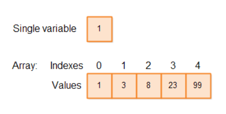
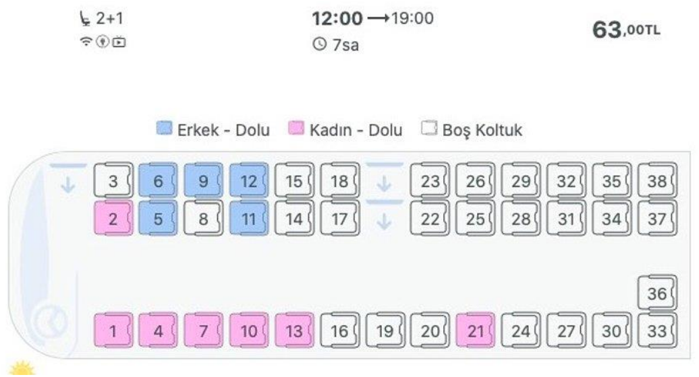
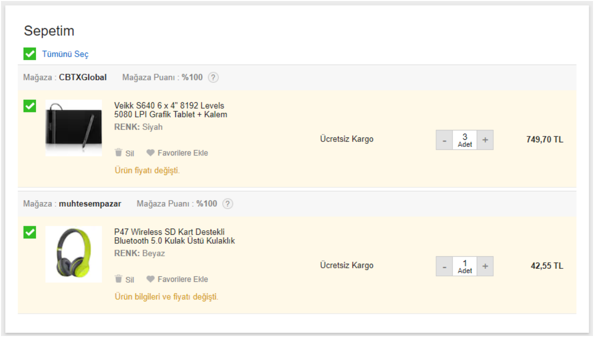
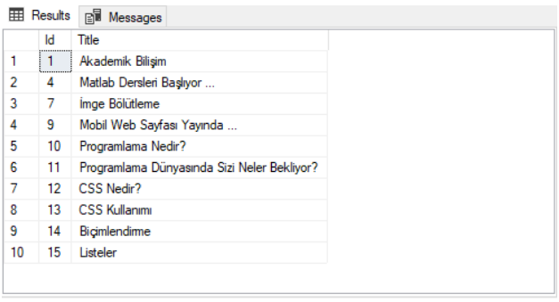
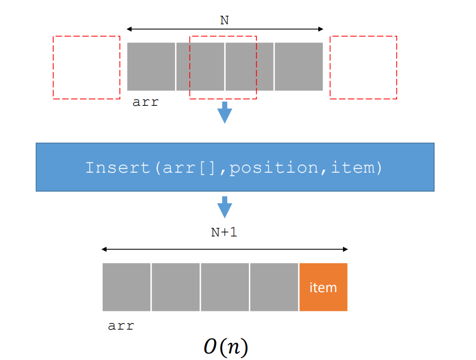
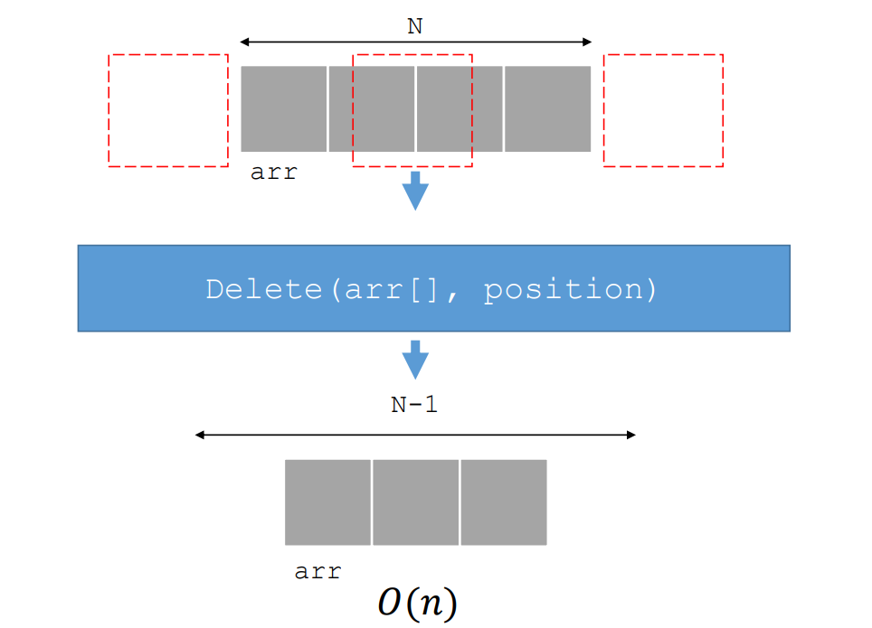
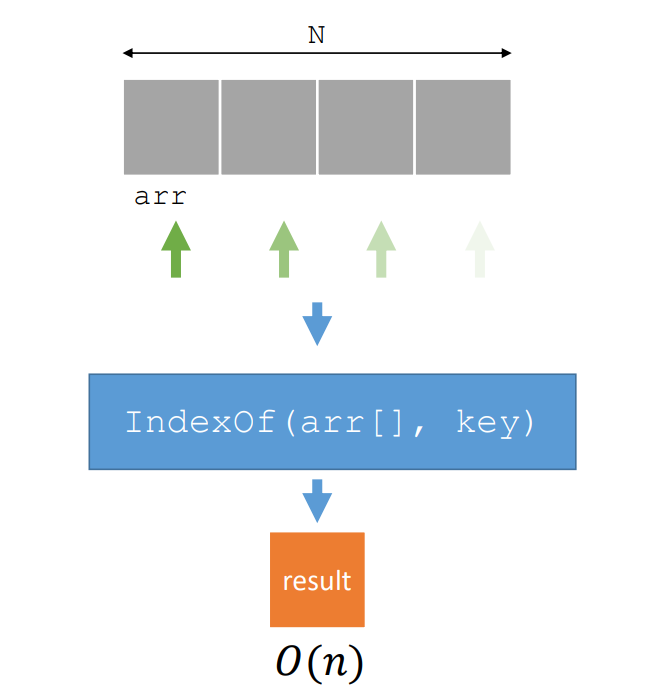

# 🟥 Array - Dizi

- 🟡 En temel veri yapılarından biridir.
- 🟡 Dizi elemanlarına erişmek üzere genellikle sıfır-tabanlı indisleme (**zero-based indexing**) kullanılır.
- 🟡 Tek boyutlu (**single-dimension**) ya da çok-boyutlu (**multidimension**) olabilir.
- 🟡 Düzenli (**regular**) ya da düzensiz (**jagged**) olarak tanımlanabilir.
- 🟡 En büyük dezavantajı **sabit boyutlu** olmasıdır.
- 🟡 Dizinin sabit boyutlu olmasından dolayı ekleme ve silme gibi işlemlerin maliyeti artar.
- 🟡 En büyük avantajı ise bellek gözlerine doğrudan erişimin olmasıdır.

## 🟦 Add(arr[],item)

## 🟦 Insert(arr[], position, item)

## 🟦 RemoveAt(arr[], position)

## 🟦 IndexOf(arr[], key)

