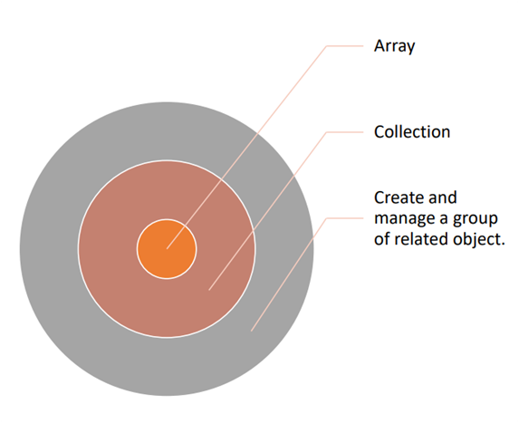

# 🟥 Collections - Koleksiyonlar

- 🟡 Bir grup nesnenin organize şekilde yönetildiği yapılar **Collections** olarak ifade edilebilir.
- 🟡 Bu yapılarda ilgili veri yapısına ekleme yapma, araya ekleme yapma, arama, sıralama ya da özel bir takım fonksiyonlar içerir.
- 🟡 **Collections** ifadeleri **generic** ya da **non-generic** olarak tanımlanabilirler.
    * Biz genellikle boxing ve unboxing işlemleri yapmamak, tip güvenliğini kaybetmemek için generic kodlamayı tercih edeceğiz. Object’ler üzerinde iş yapmayacağız.

[https://docs.microsoft.com/en-us/dotnet/csharp/programming-guide/concepts/collections](https://docs.microsoft.com/en-us/dotnet/csharp/programming-guide/concepts/collections)

- 🟡 Aynı türden verilerin organizasyonunu sağlamak üzere;
    * Array
    * Collections kullanılabilir.

- 🟡 **Array**, en çok sabit sayıda güçlü biçimde yazılmış nesneler oluşturmak ve bunlarla çalışmak için kullanışlıdır.
- 🟡 **Collections**, nesne gruplarıyla çalışmak için daha esnek bir yol sağlar.
- 🟡 Dizilerden farklı olarak, birlikte çalıştığınız nesne grubu, uygulamanın ihtiyaçları değiştikçe dinamik olarak büyüyebilir ve küçülebilir (**growing and shrinking**).

Object’lerle ve T’ye bağlı çalışan ifadelerin dışında **<TKey,TValue>** şeklinde ifade ettiğimiz bir **anahtar – değer çifti**ne göre de koleksiyon vardır.

- 🟡 Bazı koleksiyonlarda, koleksiyona eklediğiniz herhangi bir nesneye bir anahtar atayabilirsiniz, böylece anahtarı kullanarak nesneyi hızlı bir şekilde alabilirsiniz.

> [!IMPORTANT]
> **<TKey,TValue>**

ArrayList, Hashtable, Queue, Stack gibi ifadeler object'ye bağlı olarak; Dictionary<TKey,TValue>, List<T>, Queue<T>, SortedList<TKey,TValue>, Stack<T>, SortedSet<TKey,TValue>, HashSet<TKey,TValue> gibi ifadeler generic olarak çalışır.

- 🟡 System.Collections
    * ArrayList
    * Hashtable
    * Queue
    * Stack
- 🟡 System.Collections.Generic
    * Dictionary<TKey, TValue>
    * List<T>
    * Queue<T>
    * SortedList<TKey, TValue>
    * Stack<T>
    * SortedSet<TKey,Tvalue>
    * HashSet<TKey,TValue>
- 🟡 System.Collections.Concurrent
- 🟡 System.Collections.Specialized
- 🟡 System.Collections.Immutable

# 🟥 Common Collections Features - Ortak Koleksiyon Özellikleri

Koleksiyonların ortak özelliklerinden birisi bir numaralandırma yeteneğine sahip olmalarıdır. Numaralandırma yeteneğini eğer **object'ye bağlı** bir iş yapıyorsanız **IEnumerable**; eğer **generic** olarak çalışıyorsanız **IEnumerable<T>** şeklinde ifade edebilirsiniz.

- 🟡 Koleksiyonu numaralandırma yeteneği
    * System.Collection.IEnumerable
    * System.Collections.Generic.IEnumerable<T>

Eğer bu contract'ları kabul ederseniz bir **Enumerator** ifadeniz olur. Bu ifade sayesinde current (mevcut) durumda olan eleman, move next diyip bir sonraki elemanı alabilirsiniz.

Eğer bu contract'ları kabul ederseniz bir Enumerator ifadeniz olur. Bu ifade sayesinde current (mevcut) durumda olan eleman, move next diyip bir sonraki elemanı alabilirsiniz. Dolayısıyla bir foreach ifadesini koleksiyon üzerinde doğrudan kullanabilirsiniz.

**IEnumerable<T>** ifadesi, **GetEnumerator** metodunu public olarak garanti eder. GetEnumerator ifadesi üzerinden de koleksiyon üzerindeki verilerden her defasında bir örnek alınıp foreach çevrimi içerisinde kullanılabilir.

- 🟡 Bir **Enumerator**, koleksiyondaki herhangi bir öğeye taşınabilir bir işaretçi olarak düşünülebilir.
- 🟡 Bir **foreach** döngüsü **GetEnumerator** metodu kullanarak taşınabilir işaretçi yardımıyla koleksiyondaki öğeler üzerinde dolaşabilir.

Eğer IEnumerable interface’ini kabul ederseniz, yani bu contract’ı kabul ederseniz, dile entegre sorguları yani LINQ ifadelerini doğrudan ilgili koleksiyon üzerinde kullanabilirsiniz. Bu da veri yapısı dahilinde ilgili koleksiyon üzerinde filtreleme, sıralama, gruplama yapma gibi yetenekleri doğrudan sınıfınıza kazandırmış olur.

- 🟡 **System.Collections.Generic.IEnumerable<T>** sorgulanabilir bir tip olarak düşünülebilir ve LINQ ifadeleriyle sorgulanabilir.
- 🟡 LINQ sorguları, verilere erişim için ortak bir model sağlar.
- 🟡 LINQ filtreleme, sıralama, gruplama yetenekleriyle veri erişim performansını arttırır.

Koleksiyonların ortak özellikleri arasında CopyTo(), Count, Capacity vardır. Tutarlı bir alt sınır koleksiyonların ortak özelliğidir. Eğer indisleme mekanizması olacaksa burada minimum değer 0 olmalıdır.

- 🟡 **Koleksiyon içeriğini bir diziye kopyalama yeteneği**
    * Tüm koleksiyonlar CopyTo yöntemi kullanılarak bir diziye kopyalanabilir; ancak, yeni dizideki öğelerin sırası, numaralandırıcının onları döndürdüğü sıraya bağlıdır.
- 🟡 **Capacity and Count Property**
    * Bir koleksiyonun kapasitesi, içerebileceği öğe sayısıdır. Bir koleksiyon için Count, aslında içerdiği öğelerin sayısıdır. Bazı koleksiyonlar Capacity veya Count veya her ikisini birden gizler.
- 🟡 **Tutarlı bir alt sınır**
    * Bir koleksiyonun alt sınırı, ilk öğesinin dizinidir. System.Collections ad alanlarındaki tüm dizinlenmiş koleksiyonların alt sınırı sıfırdır, yani 0 dizinlidir.
- 🟡 **Birden çok iş parçacığından erişim için senkronizasyon**
    * System.Collections ad alanındaki genel olmayan koleksiyon türleri, senkronizasyonla birlikte bazı iş parçacığı güvenliği sağlar; genellikle SyncRoot ve IsSynchronized üyeler aracılığıyla gösterilir.

| Mutable                         | Amortized | Worst Case | Immutable                                | Complexity  |
|---------------------------------|-----------|------------|------------------------------------------|-------------|
| `Stack<T>.Push`                   | O(1)      | O(n)       | `ImmutableStack<T>.Push`                   | O(1)        |
| `Queue<T>.Push`                   | O(1)      | O(n)       | `ImmutableQueue<T>.Enqueue`                | O(1)        |
| `List<T>.Add`                      | O(1)      | O(n)       | `ImmutableList<T>.Add`                     | O(logn)     |
| `List<T>.Item[Int32]`              | O(1)      | O(1)       | `ImmutableList<T>.Item[Int32]`             | O(logn)     |
| `List<T>.Enumerator`               | O(n)      | O(n)       | `ImmutableList<T>.Enumerator`              | O(n)        |
| `HashSet<T>.Add, lookup`           | O(1)      | O(n)       | `ImmutableHashSet<T>.Add`                  | O(logn)     |
| `SortedSet<T>.Add`                 | O(logn)   | O(n)       | `ImmutableSortedSet<T>.Add`                | O(logn)     |
| `Dictionary<T>.Add`                | O(1)      | O(n)       | `ImmutableDictionary<T>.Add`               | O(logn)     |
| `Dictionary<T>.lookup`             | O(1)      | O(1) (or strictly) | `ImmutableDictionary<T>.lookup` | O(logn)     |
| `SortedDictionary<T>.Add`          | O(logn)   | O(nlogn)   | `ImmutableSortedDictionary<T>.Add`         | O(logn)     |

[https://learn.microsoft.com/en-us/dotnet/standard/collections/](https://learn.microsoft.com/en-us/dotnet/standard/collections/)

Toparlayacak olursak koleksiyonlar dahilinde IEnumerable<T> interface’inin implemente edilmesini sağlayacağız. Bu da bize koleksiyonumuzun foreach ile beraber kullanılması imkanını tanıyacak.

Verinin organizasyonu noktasında dile entegre sorgular (LINQ) yazılmasını sağlamak üzere IEnumerable<T> ifadesini implemente ediyor olacağız.

Çoğu veri yapımızda Count ifademiz olacak. Koleksiyonda ya da veri yapısında kaç tane eleman olduğunun sayısını tutmak üzere Count ifadesini kullanıyor olacağız.
