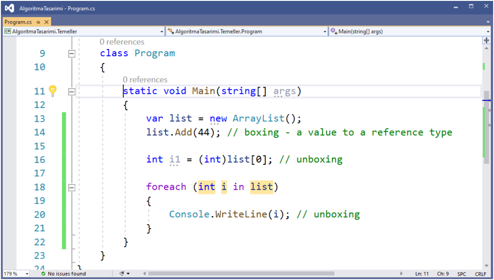
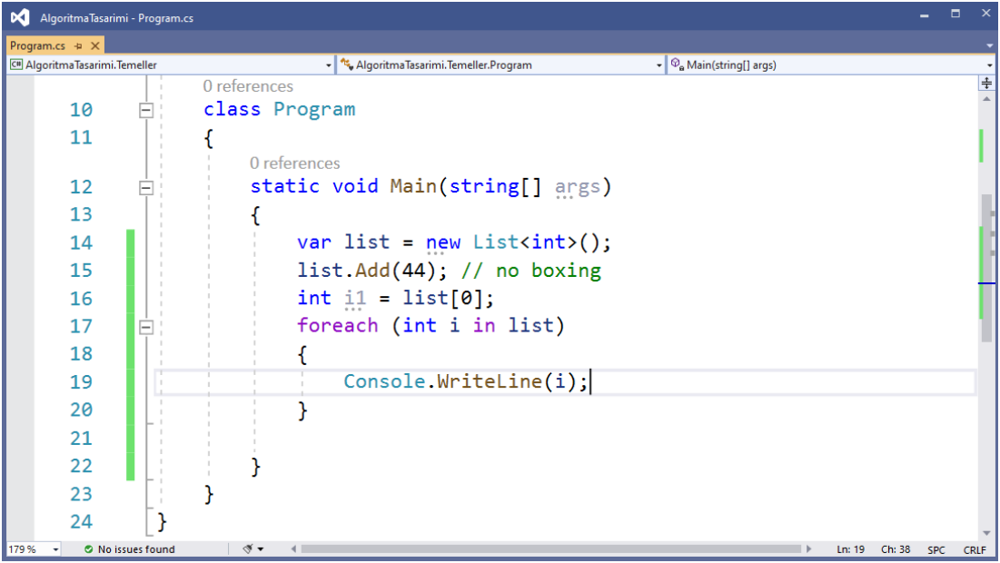

# 🟥 Generic Programming

## 🟦 Generic <T>

- 🟡 Tipden bağımsız metotlar, yapılar, sınıflar ve interface yapıları oluşturmak için kullanılabilir.
- 🟡 Tip güvenlidir.
- 🟡 Kod şişkinliğinin **(code bloating)** önüne geçer.
- 🟡 Intermediate Language (IL) ile tümleşik çalışır.
- 🟡 Kutulama (boxing) ve kutundan çıkarma (unboxing) işlemlerine göre **daha performanslı**dır.
- 🟡 Generic ifadeler Just-In-Time (**JIT**) compiler ile derlenirler (**binary code reuse**).

- 🟡 Farklı senaryolar için farklı interface yapıları kullanılır:
    * IEnumerable<out T>
    * IEnumerator<out T>
    * IComparable<T>
    * ICollection<T>

| Constraint        | Tanımı |
|-------------------|--------|
| `where T: struct` | T değer tipli olmalı. |
| `where T: class`  | T referans tipli olmalı. |
| `where T: IFoo`   | T, `IFoo` interface'ini implemente etmeli. |
| `where T: Foo`    | T, `Foo` temel sınıfından türetilmeli. |
| `where T: new()`  | T, default bir constructor'a sahip olmalı. |
| `where T1: T2`    | `T1`, `T2` tipinden türetilmeli. |

- 🟡 System.Collections
- 🟡 System.Collections.Generic
- 🟡 System.Collections.Specialized
- 🟡 System.Collections.Concurrent
- 🟡 System.Collections.Immutable

Dizilerin yerine koleksiyon sınıfları kullanılabilir.
- 🟡 Bunlar
    * List<T>
    * Queue<T>
    * Stack<T>
    * LinkedList<T>
    * Dictionary<TKey,TValue>
    * HashSet<T>
    * SortedSet<T>